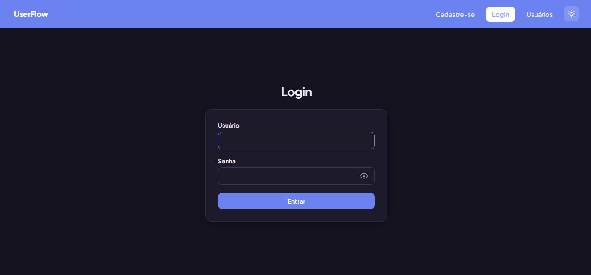
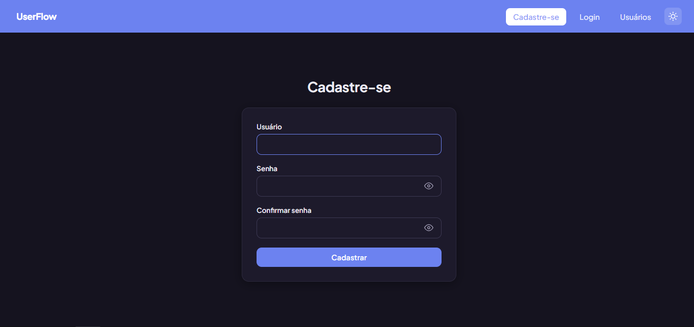
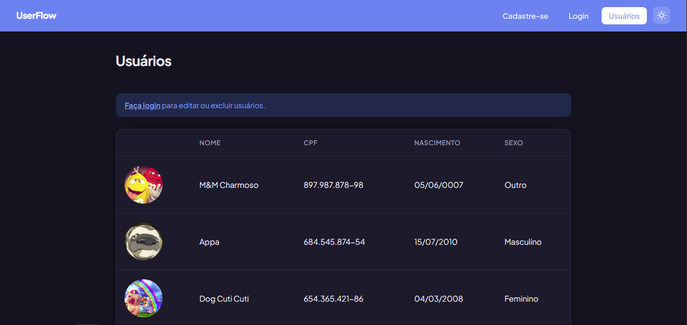
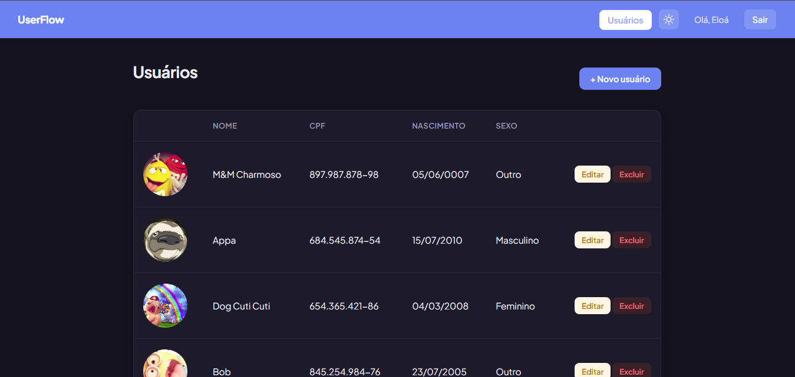
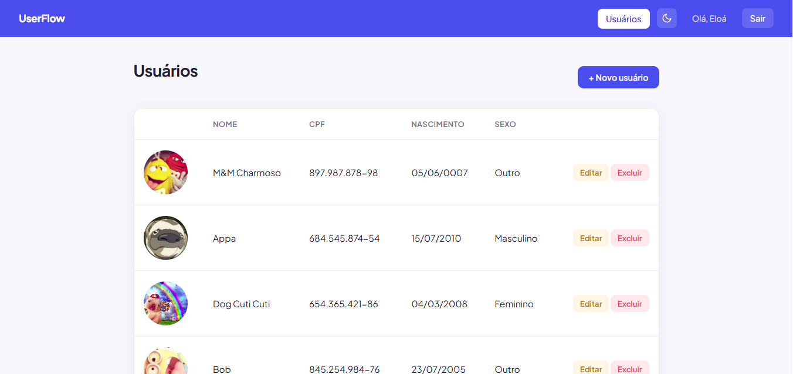

# UserFlow

Sistema de CRUD (Criar, Listar, Editar, Excluir) de usuários desenvolvido em Django, com autenticação, tema claro/escuro e upload de foto de perfil.

## Sumário

- [Funcionalidades](#funcionalidades)
- [Tecnologias usadas](#tecnologias-usadas)
- [Armazenamento de dados](#armazenamento-de-dados)
- [Como rodar o projeto localmente](#como-rodar-o-projeto-localmente)
- [Painel administrativo (Django Admin)](#painel-administrativo-django-admin)
- [Variáveis de ambiente](#variáveis-de-ambiente)
- [Testes](#testes)
- [Deploy](#deploy)
- [Estrutura do projeto](#estrutura-do-projeto)
- [Modelo de dados](#modelo-de-dados-usuario)
- [Prévia dos sistema](#prévia-do-sistema)

## Funcionalidades

- Cadastro e login de contas (usando o sistema de autenticação nativo do Django)
- Listagem de usuários com foto, nome, CPF, data de nascimento e sexo
- Máscara automática de CPF (formato `000.000.000-00`) com validação de 11 dígitos
- Upload de foto de perfil, exibida como avatar circular
- Armazenamento das fotos de perfil utilzando Cloudinary
- Edição e exclusão de usuários (requer login)
- Exclusão reversível: ao excluir, uma mensagem permite desfazer a ação
- Alternância entre tema claro e escuro, com preferência salva no navegador
- Visualização de usuários cadastrados liberada mesmo sem login (somente leitura)

## Tecnologias usadas

- Python 
- Django 
- PostgreSQL (banco de dados utilizado em produção)
- SQLite (banco de dados utilizado no desenvolvimento local)
- Pillow (processamento e validação de imagens)
- Cloudinary (armazenamento das fotos de perfil)
- django-cloudinary-storage (integração entre Django e Cloudinary para armazenamento de imagens)
- dj-database-url (biblioteca utilizada para configurar a conexão com o banco de dados através da `DATABASE_URL`)
- psycopg2-binary (adaptador utilizado para conectar o Django ao PostgreSQL)
- Gunicorn (utilizado para executar a aplicação Django em produção)
- WhiteNoise (biblioteca utilizada para disponibilizar arquivos estáticos em produção)
- HTML, CSS e JavaScript (sem frameworks externos)

## Armazenamento de dados

O projeto utiliza bancos de dados diferentes dependendo do ambiente.

### Ambiente local

Durante o desenvolvimento local, o projeto utiliza SQLite.

O banco de dados fica armazenado no arquivo:
```bash
    db.sqlite3
```

Os usuários cadastrados localmente são utilizados para testes e desenvolvimento.

### Ambiente de produção

No ambiente de produção, hospedado no Render, o projeto utiliza PostgreSQL.

A conexão com o banco de produção é feita através da variável de ambiente:
```bash
    DATABASE_URL
```

Dessa forma, os dados cadastrados localmente e os dados cadastrados no site publicado ficam separados.

### Armazenamento das fotos

As fotos de perfil são armazenadas utilizando o Cloudinary.

Isso evita que as imagens dependam do armazenamento local do servidor de Render.

## Como rodar o projeto localmente

### Pré-requisitos
- Python instalado
- Git instalado

### Passo a passo

1. Clone o repositório:
```bash
   git clone https://github.com/eloamachadomartines1/UserFlow.git
   cd UserFlow
```

2. Crie e ative o ambiente virtual:
```bash
   python -m venv venv
   venv\Scripts\activate      # Windows
   source venv/bin/activate   # Linux/Mac
```

3. Instale as dependências:
```bash
   pip install -r requirements.txt
```
4. Configure o arquivo `.env` com as variáveis necessárias.

Exemplo:
```bash
    SECRET_KEY=sua_chave_secreta
    DEBUG=True
    ALLOWED_HOSTS=localhost,127.0.0.1

    CLOUDINARY_CLOUD_NAME=seu_cloud_name
    CLOUDINARY_API_KEY=sua_api_key
    CLOUDINARY_API_SECRET=sua_api_secret
```

5. Aplique as migrações do banco de dados:
```bash
   python manage.py migrate
```

6. (Opcional) Crie um superusuário para acessar o admin:
```bash
   python manage.py createsuperuser
```

7. Rode o servidor:
```bash
   python manage.py runserver
```

8. Acesse no navegador:
```bash
http://127.0.0.1:8000/usuarios/
```

## Painel administrativo (Django Admin)

O projeto conta com o painel administrativo nativo do Django, útil para gerenciar usuários diretamente pelo banco de dados sem passar pela interface do site.

**Acesso:**
```bash
http://127.0.0.1:8000/admin/
```

Para acessar, é necessário ter um superusuário criado. Caso ainda não tenha um, rode:
```bash
python manage.py createsuperuser
```
E siga as instruções no terminal (usuário, e-mail opcional, senha).

## Variáveis de ambiente

O projeto utiliza variáveis de ambiente para armazenar configurações importantes e informações que não devem ficar diretamente no código.

As principais variáveis são:

| Variável | Função |
|---|---|
| `SECRET_KEY` | Chave de segurança do Django |
| `DEBUG` | Define se o modo de desenvolvimento está ativado |
| `ALLOWED_HOSTS` | Define os hosts permitidos pelo Django |
| `DATABASE_URL` | Conexão com o PostgreSQL em produção |
| `CLOUDINARY_CLOUD_NAME` | Nome da conta Cloudinary |
| `CLOUDINARY_API_KEY` | Chave da API do Cloudinary |
| `CLOUDINARY_API_SECRET` | Chave secreta da API do Cloudinary |

O arquivo `.env` nao deve ser enviado para o GitHub.

As chaves reais do Cloudinary também não devem ser colocadas diretamente no código ou no README.

### Acesso em produção

No ambiente do Render, também é possível criar um superusuário utilizando o Shell do serviço:
```bash
    python manage.py createsuperuser
```

## Testes

O projeto conta com testes automatizados para verificar algumas das principais regras da aplicação:

- Validação de CPF (rejeita CPFs incompletos, aceita CPFs com 11 dígitos)
- Restrição de acesso: usuários não autenticados não conseguem acessar a criação de novos registros
- Exclusão reversível (soft delete): confirma que a exclusão marca o usuário como inativo, sem removê-lo do banco

Para executar os testes:
```bash
python manage.py test usuarios
```

## Deploy

O projeto está preparado para ser executado em produção utilizando o Render.

### Serviços utilizados

- Web Service: Render
- Banco de dados: PostgreSQL
- Armazenamento de imagens: Cloudinary
- Servidor da aplicação: Gunicorn
- Arquivos estáticos: WhiteNoise

### URL da aplicação
```bash
https://userflow-j894.onrender.com/usuarios/
```
### Banco local e banco de produção 

O projeto utiliza bancos deiferentes para desenvolvimento e produção.

    Desenvolvimento local
            ↓
          SQLite
        db.sqlite3


         Produção
            ↓
       PostgreSQL
          Render

Isso significa que os usuários cadastrados no computador durante o desenvolvimento não aparecem automaticamente no site publicado.

Essa separação permite testar o sistema localmente sem alterar os dados da aplicação em produção.

### Arquivos estáticos

O WhiteNoise é utilizado para disponibilizar os arquivos estáticos da aplicação e produção.

Para colocar os arquivos estáticos:
```bash
python manage.py collectstatic --no-input
```

### Fotos de perfil 

As fotos enviadas pelos usuários são armazenadas no Cloudinary.

Dessa forma, o projeto não depende do armazenamento local do servidor para manter as imagens.

## Estrutura do projeto

```
UserFlow/
    ├── app/ # Configurações principais do projeto (settings, urls)
    ├── usuarios/ # App principal: models, views, forms, templates
    │   ├── migrations/
    │   ├── templates/
    │   │   ├── base.html
    │   │   ├── login.html
    │   │   ├── cadastro.html
    │   │   ├── listar.html
    │   │   ├── form.html
    │   │   └── confirmar_exclusao.html
    │   │
    │   ├── templatetags/
    │   │   └── usuario_filters.py
    │   │
    │   ├── models.py
    │   ├── forms.py
    │   ├── views.py
    │   ├── urls.py
    │   └── tests.py
    │
    ├── static/
    ├── media/
    ├── db.sqlite3
    ├── requirements.txt
    ├── manage.py
    └── .env
```
> O arquivo `.env` contém informações sensíveis e não deve ser enviado para o repositório público.

## Modelo de dados (Usuário)

| Campo | Tipo | Descrição |
|---|---|---|
| `id` | Inteiro | Identificador do usuário |
| `nome` | Texto | Nome do usuário |
| `cpf` | Texto (11 dígitos) | CPF único e validado |
| `data_nascimento` | Data | Data de nascimento |
| `sexo` | Escolha (M/F/O) | Masculino, Feminino ou Outro |
| `foto` | Imagem | Foto de perfil opcional |
| `ativo` | Booleano | Controla a exclusão reversível (soft delete) |

## Prévia do sistema

### Tela de login


### Tela de cadastro


### Listagem de usuários (deslogado)


### Listagem de usuários (logado)


### Tema claro


